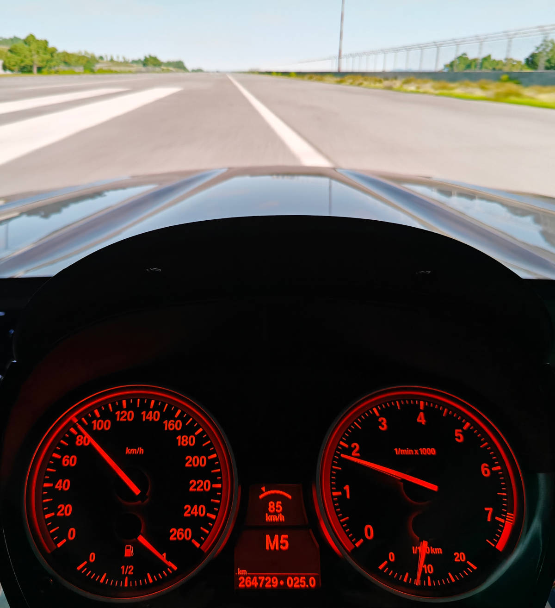

# BMW e90 CAN bus cluster project

This is a work-in-progress BMW e90 CAN bus project to connect a real car instrument cluster to a personal computer using a microcontroller. Currently I'm using _mbed LPC1768_ but the code can be ported to other platforms. [Serial CAN bus adapter](https://docs.longan-labs.cc/1030001/) is used between the microcontroller's UART port and the cluster's CAN port.

__Projects like these are floating all around the internet. This project focuses on documenting things [mostly in code] that were hard to come by. It also goes a bit further than many similar projects. Please feel free to contribute!__

__NOTE:__ _The cluster will set "tampering dot" to the bottom part of the screen when played around with. It's not adviceable to do this project on a cluster which you still plan to use in a car!_



The cluster I have is a km/h model from a car __with an automatic gearbox__. It is handy because it can show the gear selection (P, R, N, D) and manual mode (M1, M2...) as well as a "Sport" mode.

## Current capabilities

The code is able to control following things on the cluster

- Speedometer
    - ODO / trip (automatic based on speed)
    - This needed to be "calibrated", see the code
- RPM
- Indicators
- Backlight
- Light symbols (high beams, fog lights front/back)
- Fuel gauge
    - Low fuel warning is automatic based on the level
    - Range is calculated by the cluster
- Current fuel consumption needle
- Handbrake
- Gear selection (automatic gearbox cluster!)
    - Current selection (P, R, N, D)
    - Manual mode (M1, M2...)
    - "Sport" mode
- Cruise control
- Warnings ([see also](#notes-and-findings))
    - Check engine
    - Battery light
    - Low oil pressure
    - Traction control
    - Stability control
    - High or very high engine temperature
    - High clutch temperature
    - High brake temperature
    - Tire deflated (individual, all)
    - Radiator warning
    - ... and more can (and will) be added
- Water temperature
    - Visible in debug menu only ([instructions](https://www.youtube.com/watch?v=7exeRgWtkt4&ab_channel=BossM5))
- Oil level
    - Fixed value for now, but could be made dynamic
- Time and date
- Suppress warning symbols
    - ABS
    - SOS call system
    - Steering wheel
    - Airbags

## Pinout

```
               +----------+
               |  1 | 10  |
               |  2 | 11  |
               |  3 | 12  |
 Temperature E |  4 | 13  |
 Temperature M |  5 | 14  |
         CAN H |  6 | 15  |
         CAN L |  7 | 16  | BC buttons
               |  8 | 17  |
           12V |  9 | 18  | GND
               +----------+
```

__Tip:__ There are faint numbers on the cluster port marking the pin numbers. Look closely!

- __Temperature__: Outside temperature is measured with an external sensor of resistive type between pins 4 and 5. A resistor of 10k Ohm can be used to show approximately 10'C which removes the cold weather warning
- __BC buttons__: Cluster menus can be navigated by connecting pin 16 to ground with 3 buttons via resistors. The values should be 1k (Enter), 2k (Up), 3k (Down) Ohm to ground

Remember to connect the cluster GND, microcontroller GND and Serial CAN bus adapter GND together.

### Power

The cluster needs 12V power supply. 12V wall adapter can be used, but you need to make sure it's regulated. If you are unsure you should check that the voltage is roughly 12V with a multimeter when there is no load to avoid overvoltage.

## The API

The cluster is controlled over a virtual serial port using a compact **binary protocol**. The baud rate is **921600**. Framed starts with (`'S'`) and ends with (`'E'`) marker bytes.

### Frame Structure (Little Endian)

| Offset | Size | Field               | Description                          |
|--------|------|---------------------|--------------------------------------|
| 0      | 1    | `'S'`               | Start marker                         |
| 1      | 2    | `year`              | e.g., 2025                           |
| 3      | 1    | `month`             | 1–12                                 |
| 4      | 1    | `day`               | 1–31                                 |
| 5      | 1    | `hour`              | 0–23                                 |
| 6      | 1    | `minute`            | 0–59                                 |
| 7      | 1    | `second`            | 0–59                                 |
| 8      | 2    | `rpm`               | 0–65535                              |
| 10     | 2    | `speed`             | km/h × 10 (e.g. 853 = 85.3 km/h)     |
| 12     | 1    | `gear`              | 0 = R, 1 = N, 2+ = forward gears     |
| 13     | 1    | `engine temp`       | °C                                   |
| 14     | 2    | `fuel`              | 0–1000 (% × 10)                      |
| 16     | 4    | `showlights`        | Bitfield of all light states (see table below) |
| 20     | 2    | `fuel injection`    | microliters per 100 ms               |
| 22     | 2    | `custom light`      | Symbol ID (0–65535)                  |
| 24     | 1    | `custom light on`   | 1 = show, 0 = off                    |
| 25     | 1    | `gear extension`    | ASCII char: M = semi-automatic, S = sport mode, P = park, A = automatic, N = none |
| 26     | 2    | `cruise speed`      | km/h × 10                            |
| 28     | 1    | `cruise enabled`    | 1 = on, 0 = off                      |
| 29     | 1    | `'E'`               | End marker                           |

### `showlights` Breakdown

```
Bit  0 : DL_SHIFT         (Shift light) UNUSED
Bit  1 : DL_FULLBEAM      (Full beam headlights)
Bit  2 : DL_HANDBRAKE     (Handbrake engaged)
Bit  4 : DL_TC            (Traction control active/disabled)
Bit  5 : DL_SIGNAL_L      (Left turn signal)
Bit  6 : DL_SIGNAL_R      (Right turn signal)
Bit  8 : DL_OILWARN       (Oil pressure warning)
Bit  9 : DL_BATTERY       (Battery warning)
Bit 10 : DL_ABS           (ABS active/disabled) UNUSED
Bit 12 : DL_LOWBEAM       (Low beam headlights)
Bit 13 : DL_ESC           (ESC active/disabled)
Bit 14 : DL_CHECKENGINE   (Check engine light)
Bit 15 : DL_CLUTCHTEMP    (Clutch temp warning)
Bit 16 : DL_FOGLIGHTS     (Fog lights on)
Bit 17 : DL_BRAKETEMP     (High brake temperature)
Bit 18 : DL_TIREFLAT_FL   (Front left tire deflated)
Bit 19 : DL_TIREFLAT_FR   (Front right tire deflated)
Bit 20 : DL_TIREFLAT_RL   (Rear left tire deflated)
Bit 21 : DL_TIREFLAT_RR   (Rear right tire deflated)
Bit 22 : DL_RADIATOR      (Radiator warning)
Bit 23 : DL_ENGINETEMP_Y  (Engine temp yellow)
Bit 24 : DL_ENGINETEMP_R  (Engine temp red)
```

## Serial CAN bus adapter settings

- Serial CAN bus adapter has **persistent** memory for the baud rate and CAN bus speeds. You should only set them once
- Connection should be made RX to TX and TX to RX between the cluster and the Serial CAN bus adapter
- It's best to set the parameters with one-time-use-only code one at the time and have `while(1);` after the set
    - Hook up the UART code so that you can see what the adapter responds. It should say `OK` after you set a value
    - Send `+++` to go to configuration mode
    - The CAN bus towards the cluster should be set to __100 kb/s__ with `AT+C=12`
    - The serial port speed between the microcontroller and the adapter should be set to __115200__ baud with `AT+S=4`. This is the highest speed possible and is needed to be able to send CAN messages fast enough
- There should __NOT__ be 120 Ohm termination in the Serial CAN bus adapter. If it exists, it should be removed
- __The Serial CAN bus adapter can be easily overwhelmed with commands. It seems to work much better having 3 ms between sending frames. See the main loop how this can be achieved without blocking__

## Notes and findings

- There's a Discord community around hacking the clusters with lots of knowledge and information
    - [Arduino-Tacho Gang](https://discord.gg/UQFsS9D6kq)
- Lights on the cluster (like Check Engine, DTC, Oil Pressure) can be controlled with CAN ID `0x592`. See `canSendErrorLight` and codes in [symbol document](./external/E92%20checkcontrol%20symbols.pdf)
