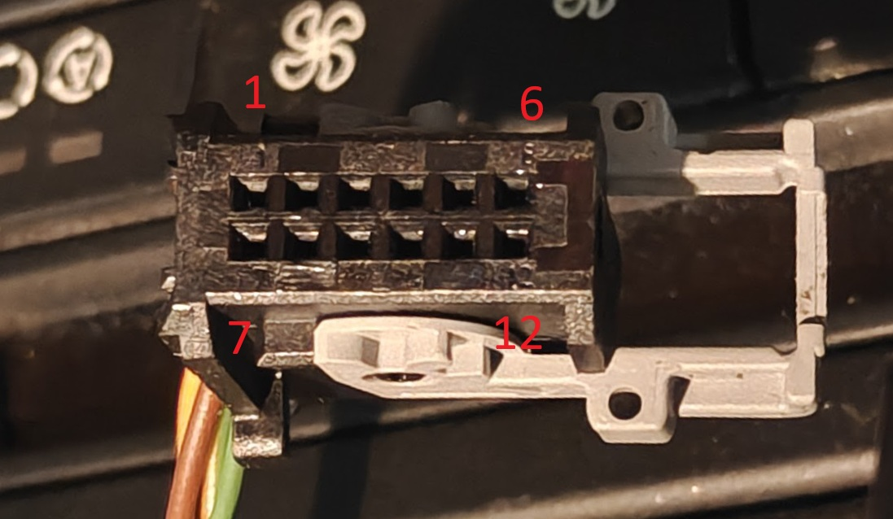

# K-CAN log dump

These K-CAN log dumps were taken from a pre-LCI 2008 M3.

An easy way to capture them is to remove the pop-up display on top of the dashboard. There are YouTube videos how to do it. Display is connected with two cables which should be disconnected from the back of the display. One of those two is the K-CAN connector. This connector carries the K-CAN bus and power. It can be then listened with an Arduino and CAN module. There should not be 120 Ohm termination on the CAN transceiver.

K-CAN (body / "Karosserie" CAN) is the comfort bus that links the instrument cluster, head unit, display and other body modules.

## Pinout

The connector pictured below is from a CCC (Car Communication Computer) unit. The E90 came with different head units, so your connector and pin layout may differ depending on the model year. Verify the pins before connecting.



```
 +----+----+----+----+----+----+
 |  1 |  2 |  3 |  4 |  5 |  6 |
 | 12V|    | GND|    |CANH|CANL|
 +----+----+----+----+----+----+
 |  7 |  8 |  9 | 10 | 11 | 12 |
 |    |    |    |    |    |    |
 +----+----+----+----+----+----+
```
